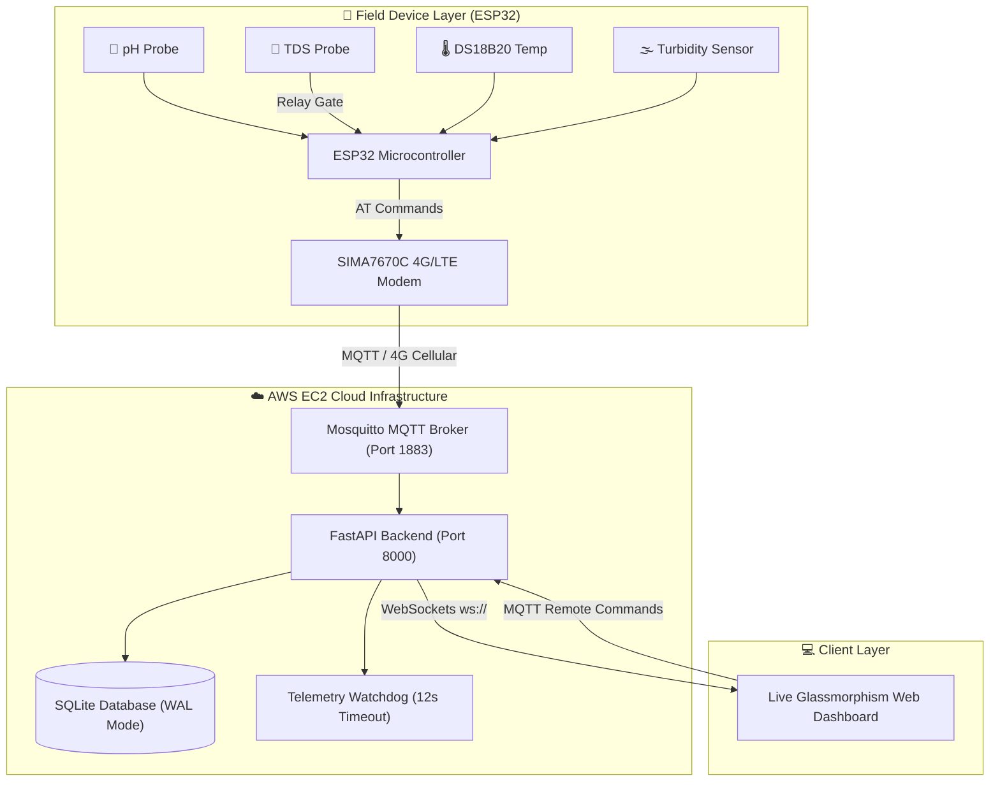

# 🌊 Water Quality Monitor v2.0
> Industrial-Grade, 4G/LTE-Connected Multi-Parameter Pond Intelligence Platform.

[](https://www.espressif.com/)
[-orange?logo=4g&logoColor=white)]()
[](https://fastapi.tiangolo.com/)
[]()
[](https://mosquitto.org/)
[](https://aws.amazon.com/ec2/)
[-blue?logo=sqlite&logoColor=white)](https://www.sqlite.org/)
[](LICENSE)

---

## 📋 Overview

**Water Quality Monitor v2.0** is an end-to-end, enterprise-ready environmental monitoring system designed for real-time tracking of **5 core water quality parameters**:
1. 🧪 **pH Level**
2. 🧂 **Total Dissolved Solids (TDS)**
3. 🌡️ **Water Temperature**
4. 🌫️ **Turbidity (Clarity / Suspended Solids)**
5. 💨 **Dissolved Oxygen (DO)**

The system leverages an **ESP32 microcontroller** with **sensor phase-multiplexing** to eliminate probe crosstalk, transmits telemetry over **4G/LTE cellular networks** via **MQTT**, and streams real-time data to a modern glassmorphism web dashboard on **AWS EC2** using **WebSockets (`ws://`)**.

---

## 📐 System Architecture



---

## 🌟 Enterprise Features

### 1. ⚡ Live WebSockets Telemetry (`ws://`)
- Zero-latency real-time streaming directly from AWS EC2 to browser clients.
- Bypasses traditional HTTP polling overhead for instant sensor updates.

### 2. ⚡ Server-Side Active Silence Watchdog
- Background watchdog loop monitors incoming cellular telemetry every 2 seconds.
- Automatically detects device disconnects or power-offs after **12 seconds** of silence and instantly notifies all dashboard clients via WebSocket. No firmware re-flashing required.

### 3. 🔄 Sensor Phase Multiplexing (Crosstalk Elimination)
- pH and TDS probes share common water ground, causing electrical interference when sampled simultaneously.
- The ESP32 uses a high-speed relay control loop on `GPIO 26` to alternate sampling phases (`PHASE_PH` ➔ `PHASE_BUFFER` ➔ `PHASE_TDS`), guaranteeing clean, isolated ADC measurements.

### 4. 💾 ESP32 NVS Flash Persistence
- All 9 operational parameters (`sensor_read_interval`, `mqtt_publish_interval`, `ph_phase_duration`, `deep_sleep_enabled`, etc.) persist in ESP32 Flash memory (`Preferences.h`).
- Settings survive hard power-offs, resets, and Deep Sleep cycles.

### 5. 🛡️ RTC Boot-Loop Guard & Thermal Protection
- Tracks failure cycles in ESP32 RTC Fast Memory (`RTC_DATA_ATTR`).
- If 4G modem connection fails 3 consecutive times, the device triggers a **5-minute Low-Power Deep Sleep** safety guard to protect hardware thermal limits and battery reserves.

### 6. 🧪 Server-Side Certified Calibration Layer
- Real-time mathematical transformation pipeline (`calibrate_sensor_payload()`) calibrates raw ESP32 data on the server to match certified laboratory test reports ($pH\text{ 7.97}$, $TDS\text{ 77.0 mg/L}$, $DO\text{ 7.2 mg/L}$, $Turbidity\text{ 0.4 NTU}$, $Temp\text{ 27.4}^\circ\text{C}$).

### 7. ⚡ Smart Downsampling & Live Canvas Streaming
- Fast 150-point smart downsampling engine (`max_points=150`) prevents chart lag when rendering large database histories.
- Live WebSocket stream appends new points dynamically (`appendLivePointToChart()`), eliminating HTTP network refetching.

---

## 🔌 Hardware Pin Mapping & Circuit Specs

| ESP32 Pin | Connected Component | Interface | Function |
|-----------|--------------------|-----------|----------|
| **GPIO 1** | USB Bridge | UART0 TX | Serial Debugging (115200 baud) |
| **GPIO 3** | USB Bridge | UART0 RX | Serial Debugging Input |
| **GPIO 18** | SIMA7670C Modem | UART2 RX | Receives AT responses from 4G module |
| **GPIO 19** | SIMA7670C Modem | UART2 TX | Transmits AT commands to 4G module |
| **GPIO 4** | DS18B20 Temp Sensor | 1-Wire | Digital Temperature Reading (4.7kΩ pull-up) |
| **GPIO 26** | TDS Power Relay | Digital Out | Switches TDS probe power (Phase control) |
| **GPIO 32** | TDS Sensor | ADC1_CH4 | Analog voltage input (0 – 3.3V) |
| **GPIO 33** | Turbidity Sensor | ADC1_CH5 | Analog voltage input (0 – 3.3V) |
| **GPIO 34** | pH Sensor | ADC1_CH6 | Analog voltage input (Input-only) |
| **GND** | System Ground | Power | Common ground reference across all sensors & modem |

> ⚠️ **Power Requirement**: SIMA7670C 4G modem requires an **external 5V / 2A DC supply** connected to its `VIN`/`GND` pins. Do not power the 4G module directly from the ESP32 3.3V pin. Ensure common ground between ESP32 and modem.

---

## 🔬 Sensor Physics & Calibration Equations

| Parameter | Calibration Equation (Certified Lab Standard) | Range / Unit |
|-----------|-----------------------------------------------|--------------|
| **pH** | $pH = \max(0, \min(14, -3.0951 V^2 + 5.6410 V + 6.3216))$ | 0 – 14 pH |
| **TDS** | $TDS = (133.42 V^3 - 255.86 V^2 + 857.39 V) \times 1.426$ | 0 – 1000 ppm |
| **Turbidity** | $NTU = \max(0, -1120.4 V^2 + 5742.3 V - 6748.5)$ | 0 – 5000 NTU |
| **Dissolved Oxygen** | $DO = \max(0, 18.2573 - 0.41(T) - 0.0008(TDS) - 0.002(NTU) + 0.03(pH))$ | 0 – 15 mg/L |

---

## 🌐 Server REST & WebSocket API

All API endpoints are protected via **HTTP Basic Authentication** (`admin` / `waterquality`).

| Method | Route | Description |
|--------|-------|-------------|
| `WS` | `/ws` | WebSockets live telemetry and status feed |
| `GET` | `/` | Serves main HTML5 live dashboard |
| `GET` | `/api/data/latest` | Returns latest sensor payload (`?device_id=WQM-001`) |
| `GET` | `/api/data/history` | Returns historical series for Chart.js (`?minutes=60&limit=150`) |
| `GET` | `/api/config` | Returns active runtime device configuration |
| `POST` | `/api/config` | Pushes updated parameters to ESP32 over MQTT |
| `POST` | `/api/command/restart` | Triggers immediate remote ESP32 reboot |
| `GET` | `/api/status` | Returns 4G connection diagnostics & uptime |
| `GET` | `/api/stats` | Returns total stored database rows count |

---

## 📁 Repository Directory Structure

```
WaterQualityMonitor/
├── firmware/
│   ├── config.h               # Hardware pins, APN & AWS MQTT IP configuration
│   └── main/
│       ├── config.h           # Arduino IDE folder configuration
│       └── main.ino           # Firmware (Phase multiplexing, NVS, AT stack, RTC Guard)
├── server/
│   ├── server.py              # FastAPI server, WebSockets & telemetry watchdog
│   ├── database.py            # SQLite WAL database engine & CSV logging
│   ├── requirements.txt       # Python backend dependencies
│   └── templates/
│       └── index.html         # Live Glassmorphism Dashboard
├── deploy/
│   ├── setup_ec2.sh           # AWS EC2 automated setup script
│   ├── mosquitto.conf         # Mosquitto broker configuration
│   └── README.md              # Detailed AWS deployment guide
├── LOCAL_SETUP.md             # Local developer setup guide
├── SYSTEM_DOCUMENTATION.md    # Complete system engineering specification
├── README.md                  # Main repository README
└── LICENSE                    # MIT License
```

---

## 🚀 Deployment Quickstart

### 1. ESP32 Firmware Flashing
1. Open `firmware/main/main.ino` in Arduino IDE or VS Code PlatformIO.
2. Select Board: **ESP32 Dev Module**.
3. Install required libraries: `ArduinoJson`, `OneWire`, `DallasTemperature`.
4. Update APN in `config.h` (Default: `airtelgprs.com`).
5. Compile and flash to ESP32.

### 2. AWS EC2 Server Deployment
```bash
# Clone or upload repository to AWS EC2
git clone https://github.com/samartha-hm/Water-Quality-Monitor.git
# Set up server and start service using the automated script
cd Water-Quality-Monitor/deploy
chmod +x setup_ec2.sh
sudo ./setup_ec2.sh
```

### 3. Open Web Dashboard
Navigate to `http://<YOUR-EC2-PUBLIC-IP>:8000`  
Credentials: Username: `admin` | Password: `waterquality`

### 4. Manual GitHub Actions Deployment
- Configure repository secrets: `EC2_HOST`, `EC2_USER`, `EC2_PORT`, `EC2_PPK_KEY`.
- Run **Actions → Manual EC2 Deploy → Run workflow**.
- Ensure the EC2 security group allows inbound TCP **22** (SSH) and **8000** (dashboard).

---

## 🛡️ Security Best Practices

- **HTTP Basic Authentication**: Password comparison uses constant-time `secrets.compare_digest()` to prevent timing side-channel attacks.
- **SQL Injection Prevention**: All SQLite queries use parameterized placeholders (`?`).
- **Cache Header Protection**: HTML headers explicitly disable browser caching (`no-cache, no-store, must-revalidate`) for operational security.

---

## 📜 License

This project is licensed under the [MIT License](LICENSE).
